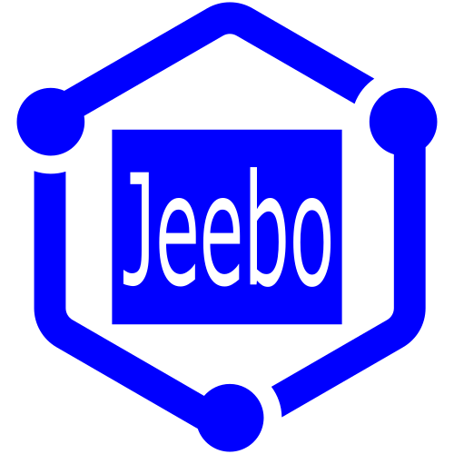

# Jeebo

  Some web app tooling

  

## 🌐 Infos

💡 _[Jeebo](https://www.kitql.dev/docs) itself is not a library, it's "nothing" but a collection of
standalone libraries._

---

| Package\*                                          |                                                       Version                                                        |                                                    Downloads                                                    |
| :------------------------------------------------- | :------------------------------------------------------------------------------------------------------------------: | :-------------------------------------------------------------------------------------------------------------: |
| [@jeebo/helpers](./packages/helpers/README.md)     |      |      |
| [@jeebo/cli](./packages/cli/README.md)             |              |              |
| [@jeebo/templates](./packages/templates/README.md) |  |  |
| [@jeebo/internals](./packages/internals/README.md) |  |  |

_\*Order by subjective usefulness_ 😉

## ⭐️ Join us

## ✨ Contributors

<!-- ALL-CONTRIBUTORS-BADGE:START - Do not remove or modify this section -->
<!-- ALL-CONTRIBUTORS-BADGE:END -->

Thanks goes to these wonderful people ([emoji key](https://allcontributors.org/docs/en/emoji-key)):

<!-- ALL-CONTRIBUTORS-LIST:START - Do not remove or modify this section -->
<!-- ALL-CONTRIBUTORS-LIST:END -->

Wanna contribute? More info on [this page](./CONTRIBUTING.md)
